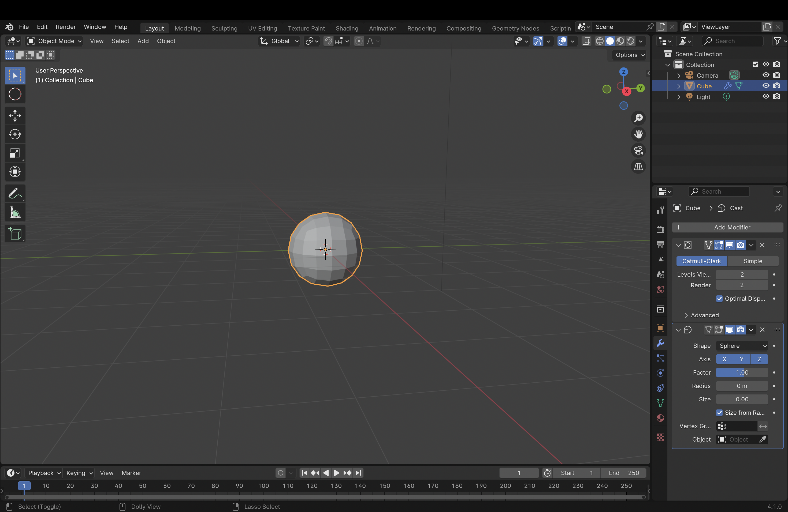
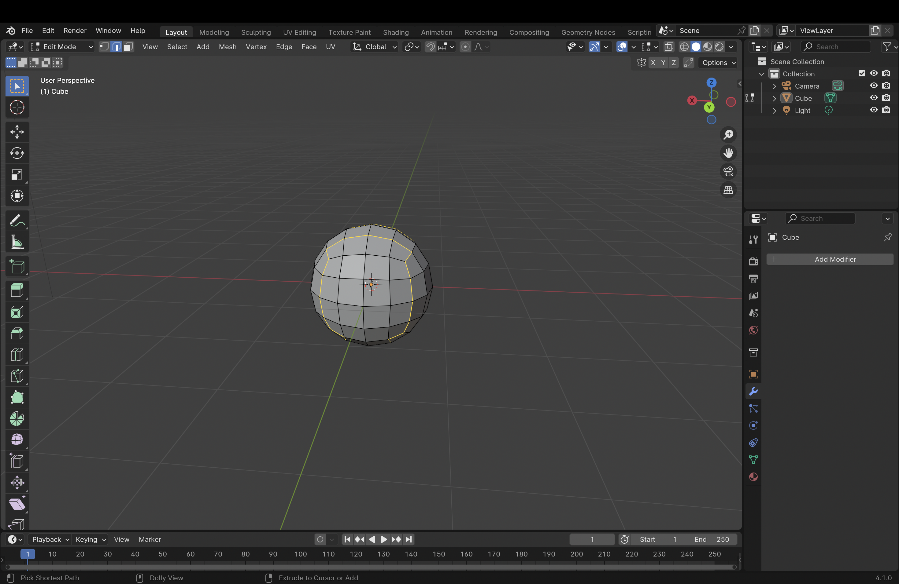
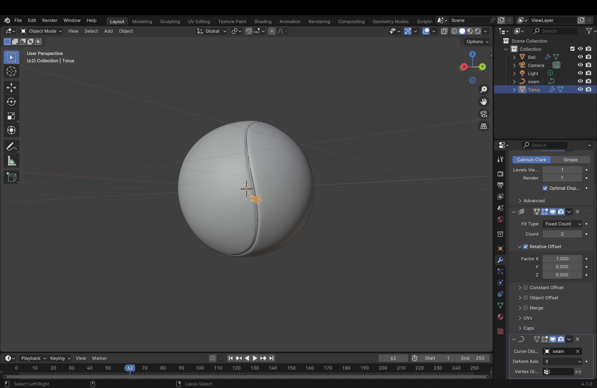
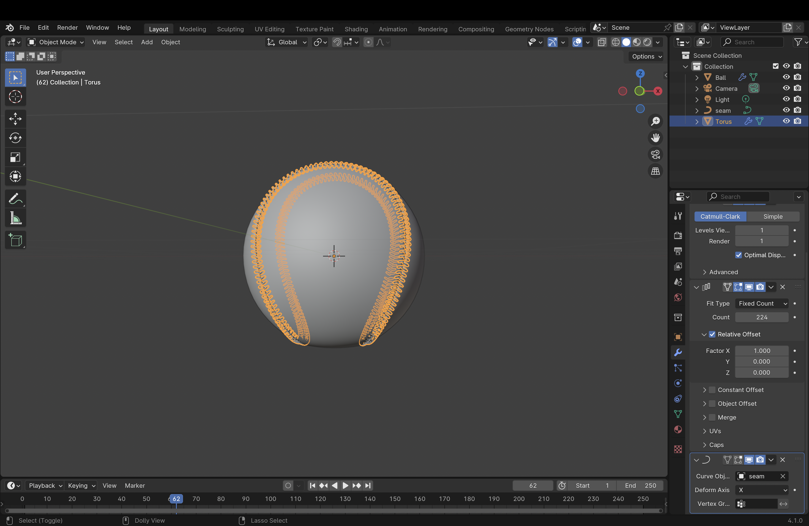
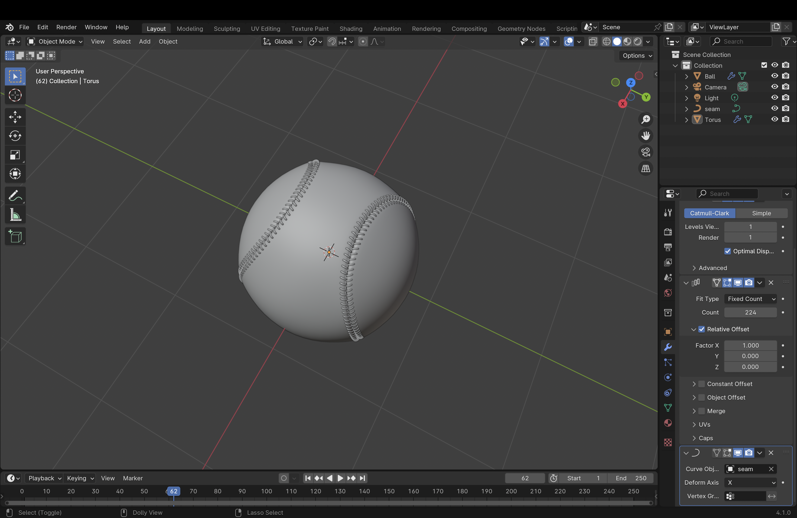
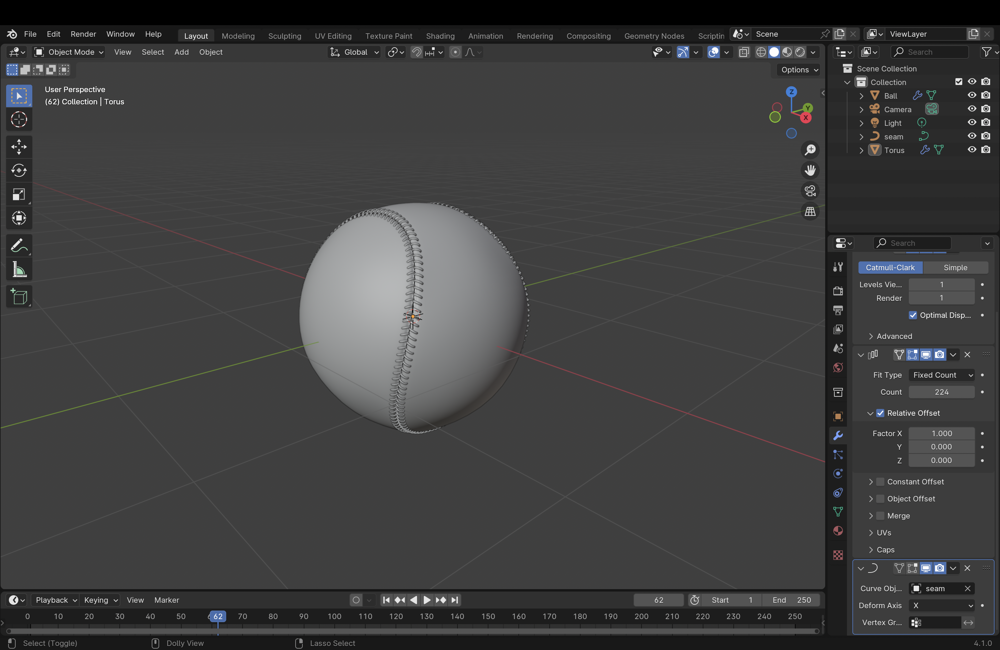
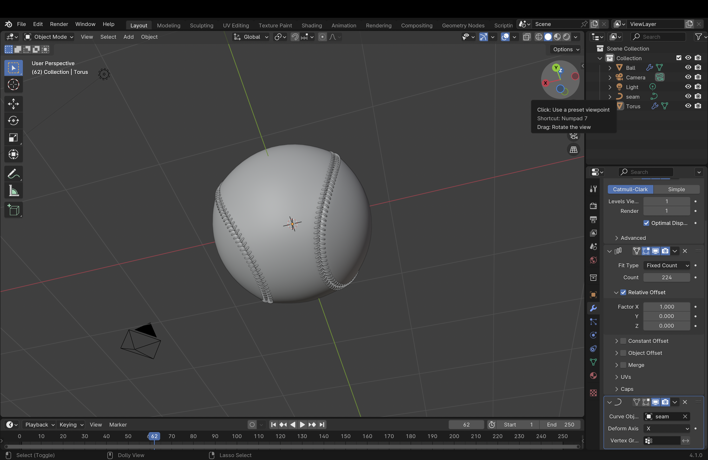

# Onshape vs Blender

In this project, I tried to explore the different function of CAD and Mesh by attempting to model a baseball on two different softwares; Onshape and Blender.

## Research on the characteristics

**CAD/boundery representation**
* defining enclosed surfaces
* describe the object shape with collection of surfaces, edges and vertices
* form volume
* mathematic expression (NURBS)
* capable of forming precise, smooth curves
* higher editability
* more useful for engineering anf manufacturing
  Thus is used to design/engneer products in the virtual space before bringing it to the actual world

**3D design software/mesh**
* collection of polygons to define surfaces
* the more polygons used to model, the more accurate the model will be
* can create complex shapes with the surfaces of polygons
* model can be manupulated by moving the vertices
* doesn't define the volume and size
* more useful for 3D animation and simulation
  Thus is used to design items that only exist in the virtual space

## Using Onshape to CAD a baseball

Since this was my first time modeling a complicated shape on Onshape, I followed a tutorial with a little bit of change in process to make it closer to a baseball: [Tennis Ball Onshape by Tony Beadle](https://www.youtube.com/watch?v=vFKDozhdCD8)  

-------------------------------------

#### I created a sphere by revolving a cicle with a diameter as an axis 
-------------------------------------

#### I drew a line that consist of an 180 dgree arc and two lines perpendicular to each other to project on to the sphere created to mimic the baseball pattern.
-------------------------------------

#### I created three circles as bases for sweep
-------------------------------------

#### First sweep that adds a solid line with radius of 1mm
-------------------------------------

#### Second sweep that adds a solid line with radius of 1mm
-------------------------------------

#### Third sweep that extracts a solid line with radius of 0.75mm
-------------------------------------

#### I added colors to the model. Because of lack of skill and time, I couldn't add the stiches of the baseball on to this model, and this is the final product. 
-------------------------------------
### Reflection
This software allowed me to easily create a geometrical shapes and lines such as sphere, reactangle and circle, but I found creating designs challenging (drawing the line and the stiches in a baseball).

## Using Blender to 3D design a baseball
This was my frist time using blender, so I followed a tutorial:[Blender 野球ボールを作ります 初級モデリング by Sphere Cube](https://www.youtube.com/watch?v=u-8H80oB9AI)

-------------------------------------

### Steps I took to 3D design (abbreviated, only main steps)
1. Create a sphere from the default cube by using subdivision surface.
2. Change to edit mode and select the edges that is going to form the shape of the seam in baseball.
3. Use loop tools (relax) to smoothen the edges.
4. Rescale the surfaces of the seam smaller so it creates an indent.
5. Use subdivision surface tool to smoothen the sphere.
6. Select the edges that creates the seam, and seperate. Convert it to a curve.
7. Now, start creating the stich by adding a torus and rotating it 20 degrees on the y axisl. Duplicate it and rotate the duplicate -40 degres on the y axis.
8. Adujust the placement, and shade smooth to smoothen the surface. Scale it to 0.03x. 
9. Use the curve modifier, and select the seperated seam as the curve object.
10. Use transform to rotate and place the stiches around the seam at a ranght angle.
11. Use array to duplicate the stiches all around the seam.

### Pictures of the process

## Reflection
Onshape:
* Easier to create a sphere and draw lines
* Assigning size and length (absolute value)
* Assigning constraints
* Less flexibility and more challenge creating complicated designs (the stiches)

Blender:
* Easier to create different shapes and add them together.
* More flexibility in design
* More steps when using geometric shapes
* Relative value (for example, 0.8x the original shape)

#### Which software suit this project better?: **Blender**
This is because this object only uses simple geometric shape (sphere), and more complicated design (the stiches and the unique curve of the seam). For this project, I think using Blender allowed me to add more designs that were key to the characteristics of the object. Also, baseballs are manufactured by traditional methods which allows the use of the materials and structure of the ball, so there is no demand in 3D printing the CAD model of a baseball. Thus, I argue that Blender worked better for this project of 3D modeling a baseball

## Conclusion
CAD softwares such as Onshape are useful when modeling an abject mainly consist of geometric shapes and less design. It is also useful when manipulating a shape of a product with given dimension. If there is a demand of 3D priniting the 3D model, using CAD models will be a better choice.
On the other hand, 3D design softwares are useful when modeling an object that have more design aspects than geometric shapes. When the main purpose of the model happens inside the virtual reality space, 3D models will be a better choice.
