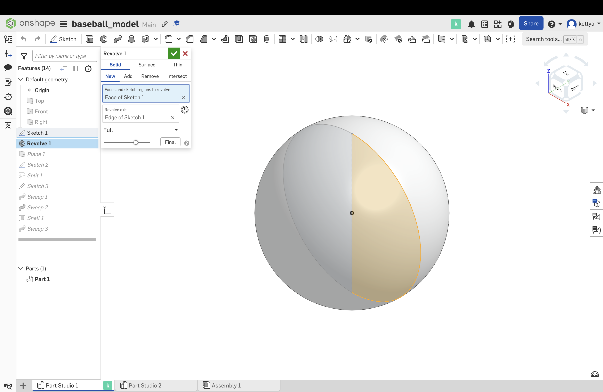
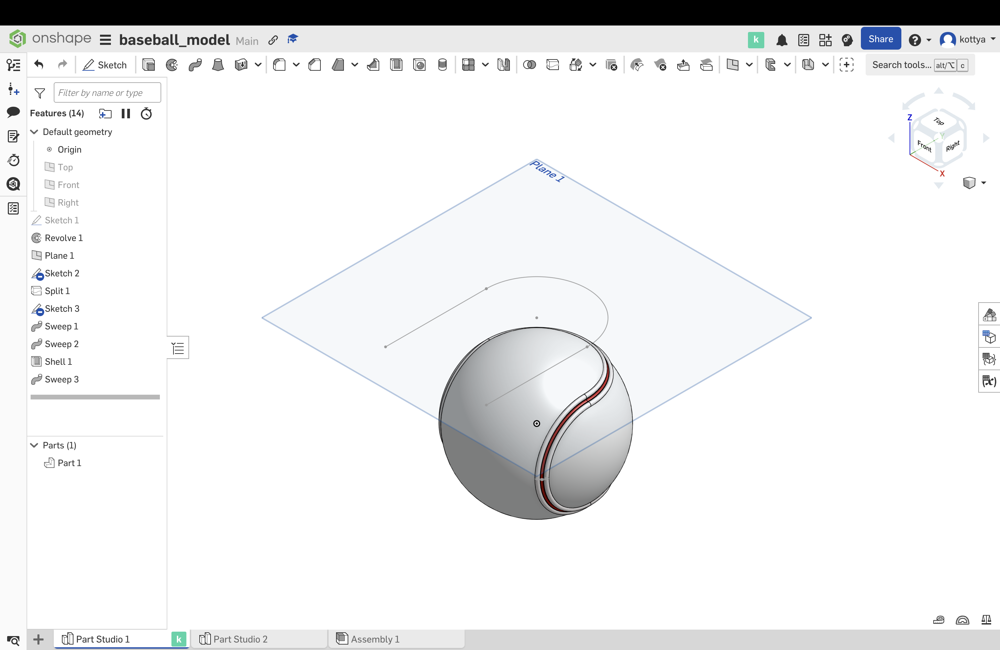
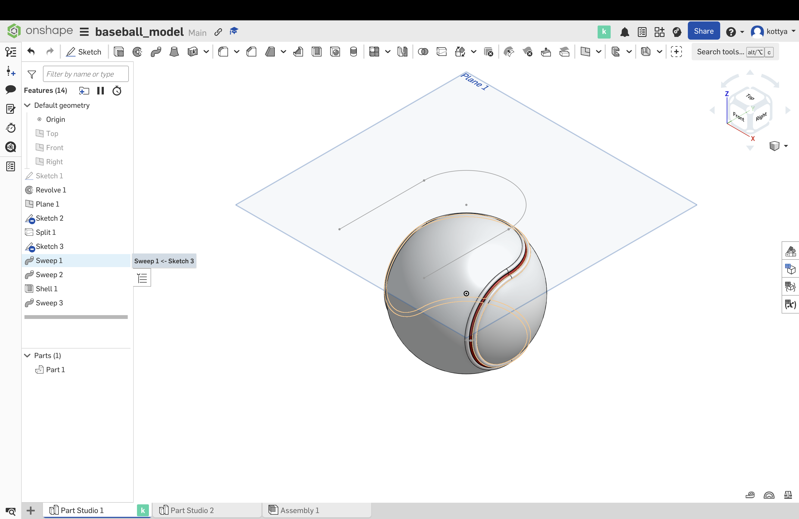
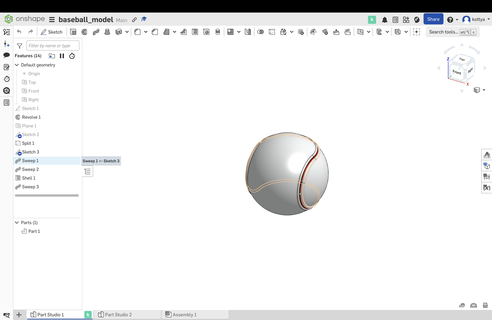
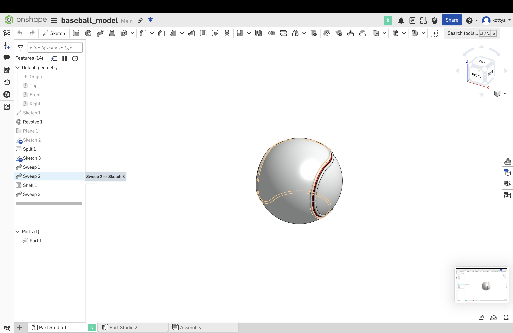
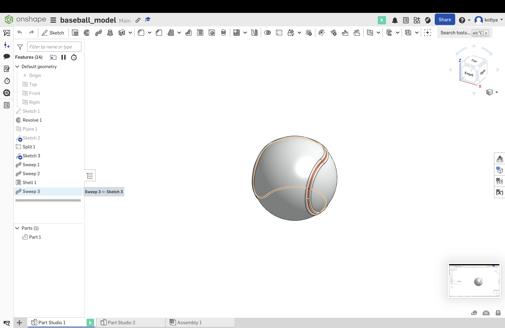
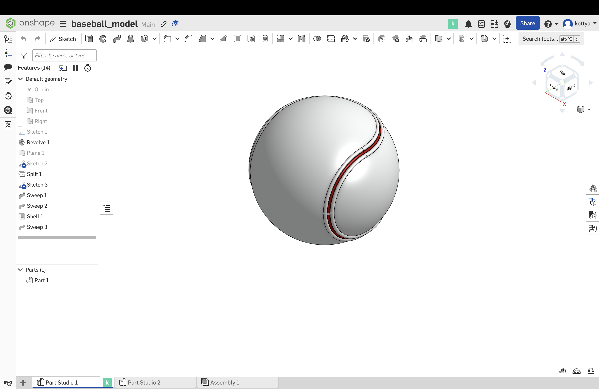

# Onshape vs Blender

In this project, I tried to explore the different function of CAD and Mesh by attempting to model a baseball on two different softwares; Onshape and Blender.

## Research on the characteristics

**CAD/boundery representation**
* defining enclosed surfaces
* describe the object shape with collection of surfaces, edges and vertices
* form volume
* mathematic expression (NURBS)
* capable of forming precise, smooth curves
* higher editability
* more useful for engineering anf manufacturing
  Thus is used to design/engneer products in the virtual space before bringing it to the actual world

**3D design software/mesh**
* collection of polygons to define surfaces
* the more polygons used to model, the more accurate the model will be
* can create complex shapes with the surfaces of polygons
* model can be manupulated by moving the vertices
* doesn't define the volume and size
* more useful for 3D animation and simulation
  Thus is used to design items that only exist in the virtual space

## Using Onshape to CAD a baseball

Since this was my first time modeling a complicated shape, I followed a tutorial with a little bit of change in process to make it closer to a baseball: [Tennis Ball Onshape by Tony Beadle](https://www.youtube.com/watch?v=vFKDozhdCD8)  

-------------------------------------

#### I created a sphere by revolving a cicle with a diameter as an axis 
-------------------------------------

#### I drew a line that consist of an 180 dgree arc and two lines perpendicular to each other to project on to the sphere created to mimic the baseball pattern.
-------------------------------------

#### I created three circles as bases for sweep
-------------------------------------

#### First sweep that adds a solid line with radius of 1mm
-------------------------------------

#### Second sweep that adds a solid line with radius of 1mm
-------------------------------------

#### Third sweep that extracts a solid line with radius of 0.75mm
-------------------------------------

#### I added colors to the model. Because of lack of skill and time, I couldn't add the stiches of the baseball on to this model, and this is the final product. 
-------------------------------------
### Reflection
This software allowed me to easily create a geometrical shapes and lines such as sphere, reactangle and circle, but I found creating designs challenging (drawing the line and the stiches in a baseball).

## Using Blender to 3D design a baseball

