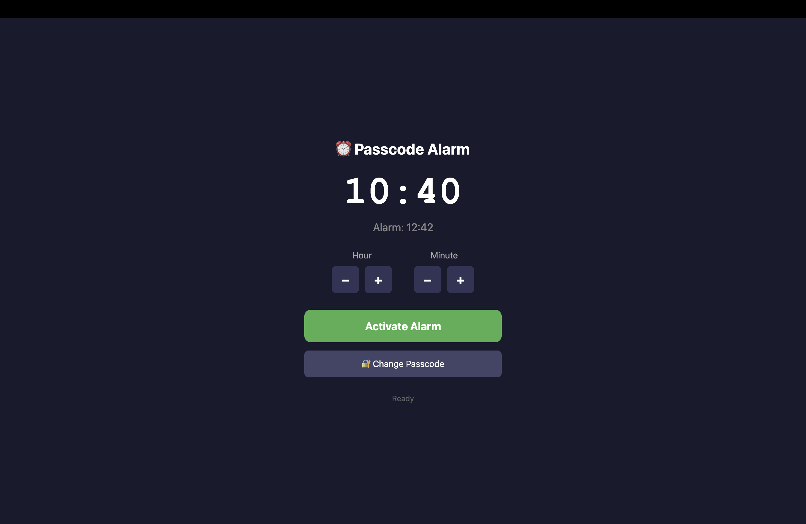
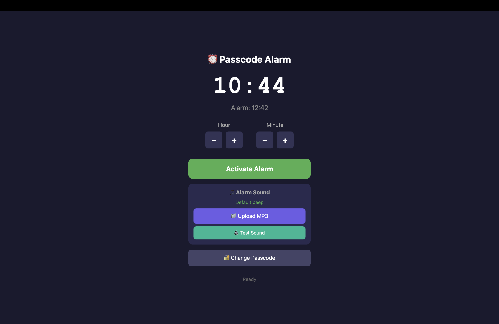
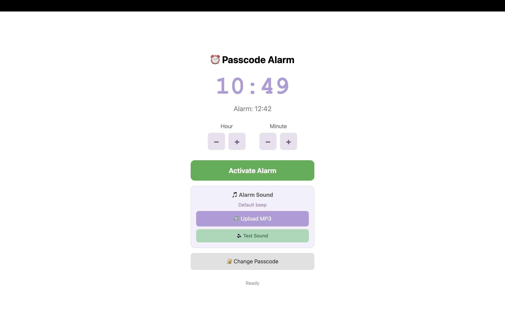
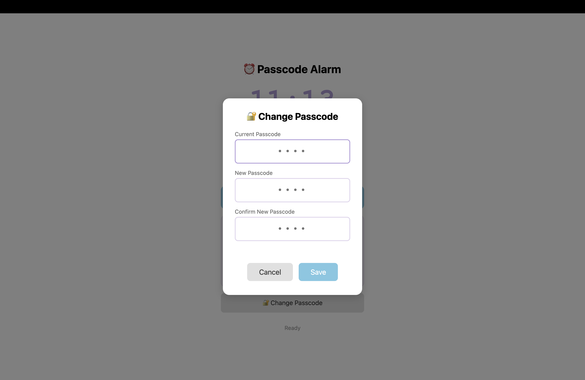
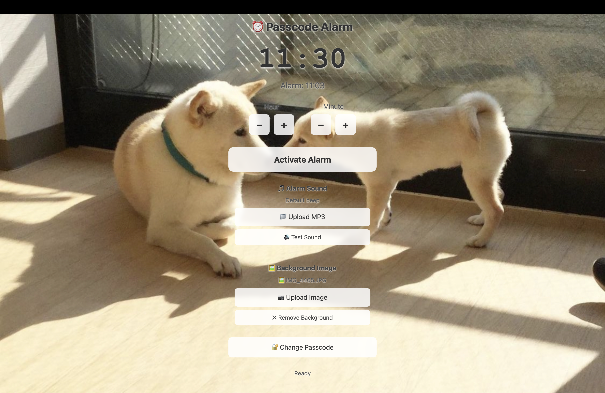

# Alarm Clock Project

### Motivating Question:
- How can I help improve my families' life with my product?

### Material
- MacBook
- GitHub
- WebbGPT
--------------------------------------------

### Phase 1: Who?
I interviewed my dad to figure out what problems he have and what I can solve by doing a project. He told me that he has been doing a lot of chores recently, and one of his hardest tasks in a day is waking up my little sister.

----------
### Phase 2: What?
I brainstormed to come up with possible solutions in no/low tech and mid tech approach.

No tech:
- Do a presentation to teach her the importance of sleep, and convince her to sleep earlier.
- Stop using electronic device early
- Open the window and take her blanket off

Low ~ Mid tech:
- Make an app/website/alarm clock that can be controlled my dad to prevent snoozing
- Play her favorite music/ MVs

-----------
### Phase 3: How?

My first idea was to make an app that can play her favorite music, and can be controlled by my dad. However, after a little bit of research, I found out that iOS have unique system of notification when apps are closed. I also researched about connecting/relating two devices, which will invlove coding with high complication. Thus, I first decided to make a website with alarm functions with passcode.

(Because of my inability for coding, I relied on [WebbGPT](www.webbgpt.ai) for coding for this project. However, I only used it to make my ideas come to life)

1. I started with a simple website where people can set an alarm with a passcode. Here is the first version:[Alarm first draft](https://kottya.github.io/projects/alarm/ver1)

2. I added a function where people can upload their favorite music as mp3 to use it as their alarm: [Alarm second draft](https://kottya.github.io/projects/alarm/ver2)

3. I realized that the version of the draft then allowed people to change passwords. Since my goal is for my dad to use this to wake up my sister, I figured that it is the best if I can lock the password changing function itself:[Alarm third draft](https://kottya.github.io/projects/alarm/ver3)

   

5. I added background changing function to add a little joy to waking up: [Alarm fourth draft](https://kottya.github.io/projects/alarm/ver4)

6. I changed the plaement of buttons so it won't interfere with the background step: [Alarm final draft](https://kottya.github.io/projects/alarm/)

-------------

### Growth

- My strength: improving the prototype even after it is done

- what did you learn about your stakeholders, the design process, and technical aspects of your experiment?

  My dad and my sister: I think this was a great chance for me to catch up with my family and learn what was going on in their life, since I have been missing out on a lot after leaving my home and coming to Webb. I learned a lot about his new business which ended not aligning with the process, but I found it very interesting and I learned a lot about his values.

- Design process: I learned how to limit function and choose what to sacrifice and what to not in order to make it to the deadline. In this project I decided to not make it into an app and not have inter-device connections in order to have a prototype by the deadline

- Technical aspect: I learned about the notification limitation of iOS.

