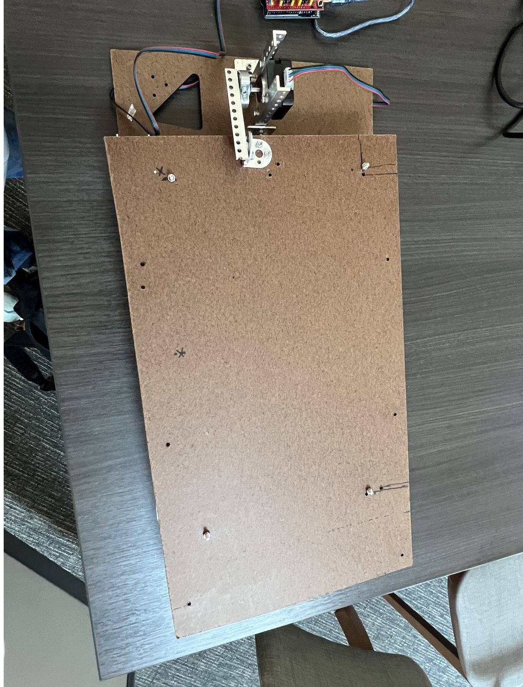
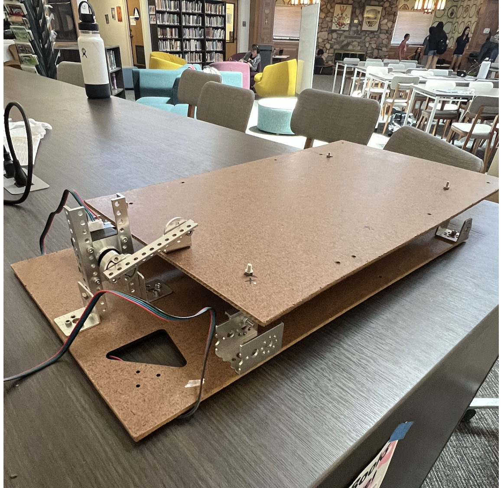
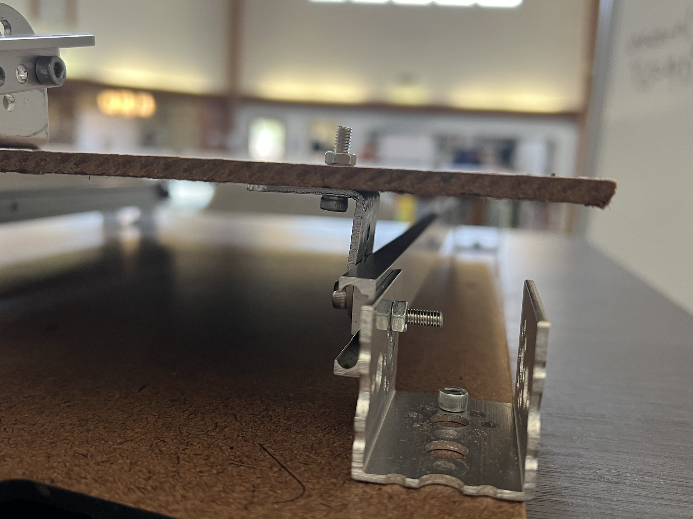
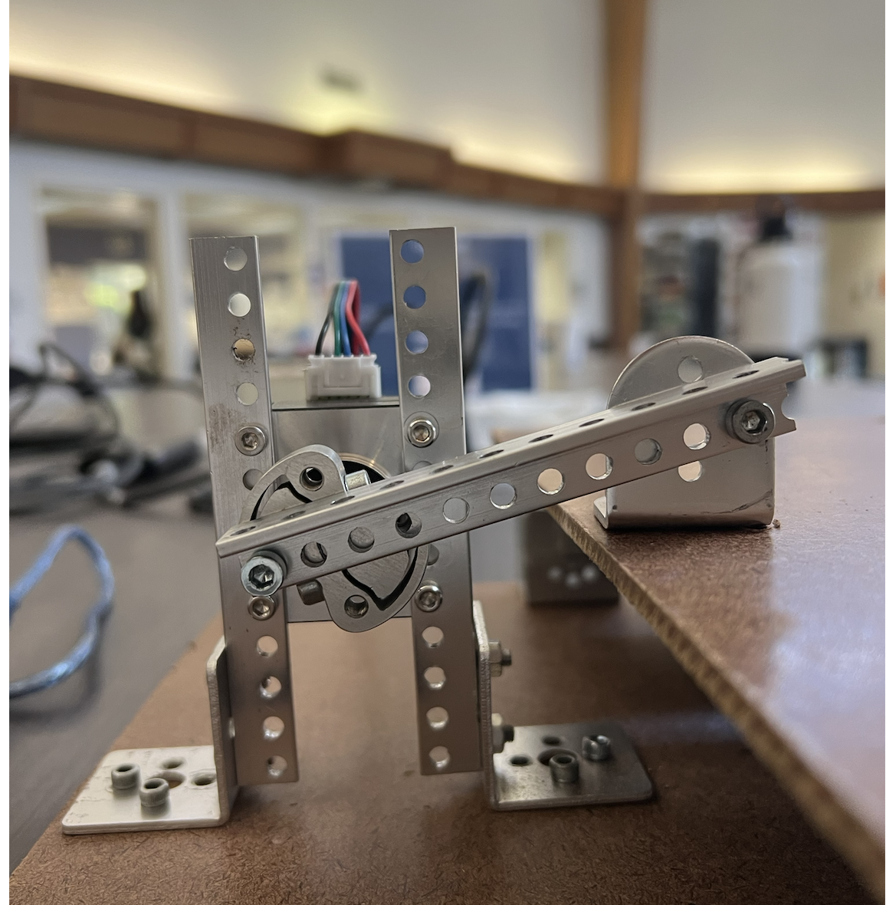
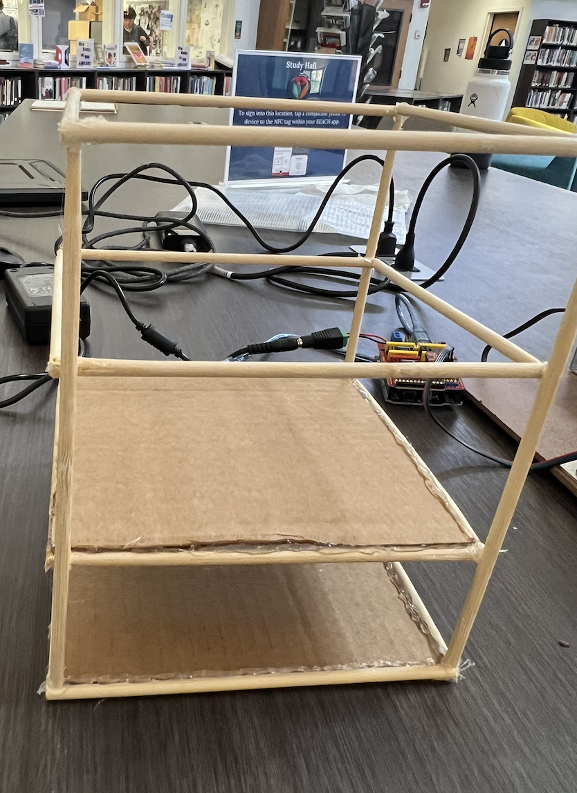
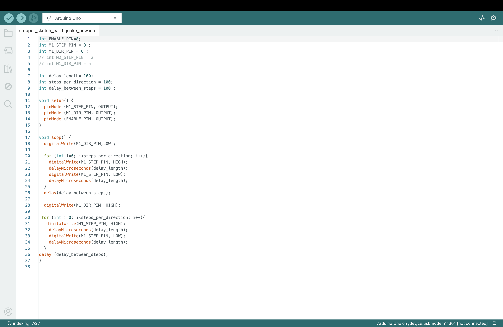

# Earthquake projects
## Innovator Journal 02

### Progress: (after Spring break)
- I finished my last prototype of the shake table
- Arduino program to control the shaking
- started exploring/buliding structures to test with the shake table

--- 

### Shake table:

- improved friction by using the rail vertically
- changed to stepper motor for control

--- 

### Structure (work in progress):

- I will add the floors and walls
- Use this as basis and add different parts to compare (strengthen the corner, damping, base isolation)
- Adding coins/weights to simulate the real buildings
  

--- 

### Arduino

- I explored and changed up the delay length, steps per direction, and delay between steps to recreate the most earthquake-like shake.

---

### Problem

Because of its unsymmetrical shape, the shaking motion is inconsistent depending on where the screw starts (reference the video below). As a temporary solution, I decided to start it with the left top corner every try for consistency.

<video width="320" controls>
  <source src="rightplacement.mp4" type="video/mp4">
</video>

<video width="320" controls>
  <source src="wrongplacement.mp4" type="video/mp4">
</video>

---
### Plan until the end of the year

1. Finish building at least one structure and create a presentation before USC presentation day
2. Revise with the USC students feedback after the presentation day.
3. Finish building at least one example for basic, seismic resistant, damping, and base isolation
4. Test each with different shake frequency etc.
5. Analyse the result
---
### USC presentation

   
