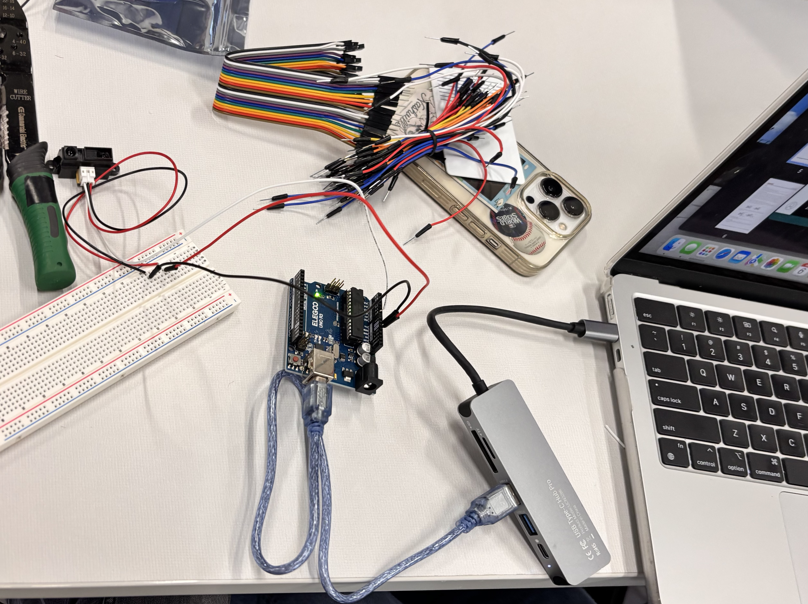
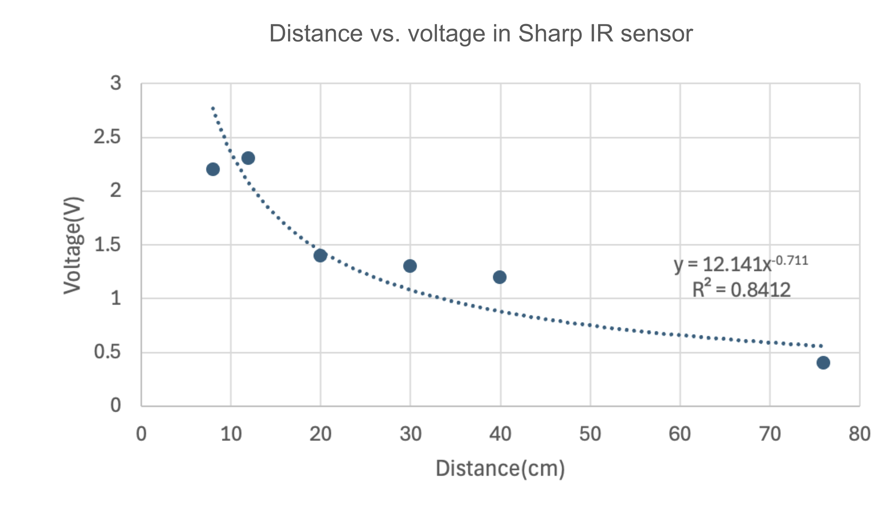
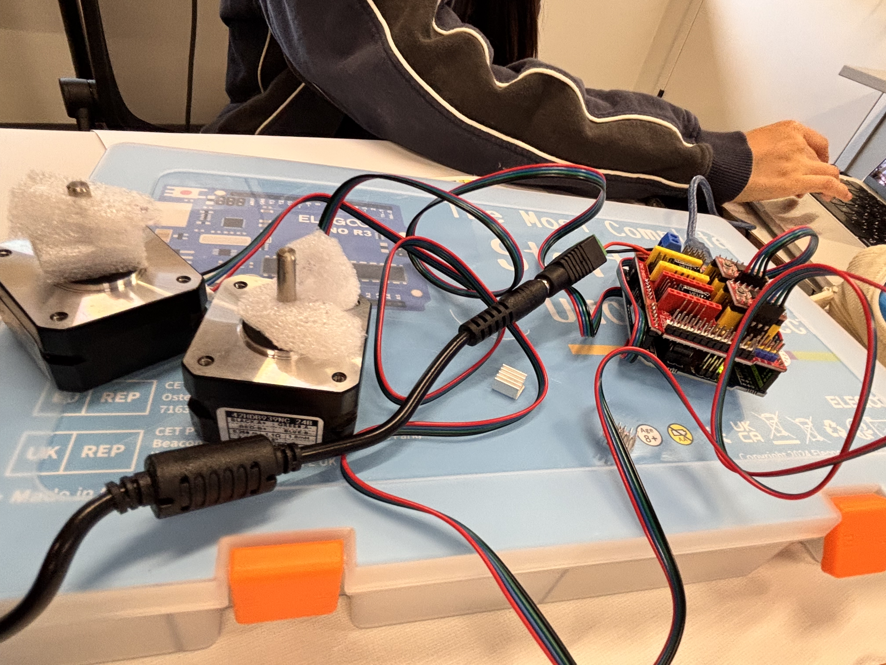

# Innovator Journal

## 3D scanner project

### Journal No.01
#### Question: 

How can we create a 3D scanner?

#### Materials:

group 1:
- breadboard
- Arduino
- wires
- sensor
- computer (Macbook Air)
- Adapter

group 2:
- stepper mortor
- Arduino sheild
- wires

#### Process:

Class 1

**1. Assembling**

Setting up the group 1 materials listed above;

**2. Coding**

We used the sample code on the [Arduino Website](https://docs.arduino.cc/language-reference/en/functions/analog-io/analogRead/) to get the output from the sensor as numbers on the computer;

This out output on the computer shows the voltage of the sensor. As it is shown in the chart below, this sensor outputs different voltage depending on the distance;

My partner and I created the following power law regression equation using a chart and generated the code with Webb GPT to output the actual distance;

 

**3. Assembling the group 2 materials** 

We connected the stepper motors with the Arduino board using the Arduino sheild;

 
 

