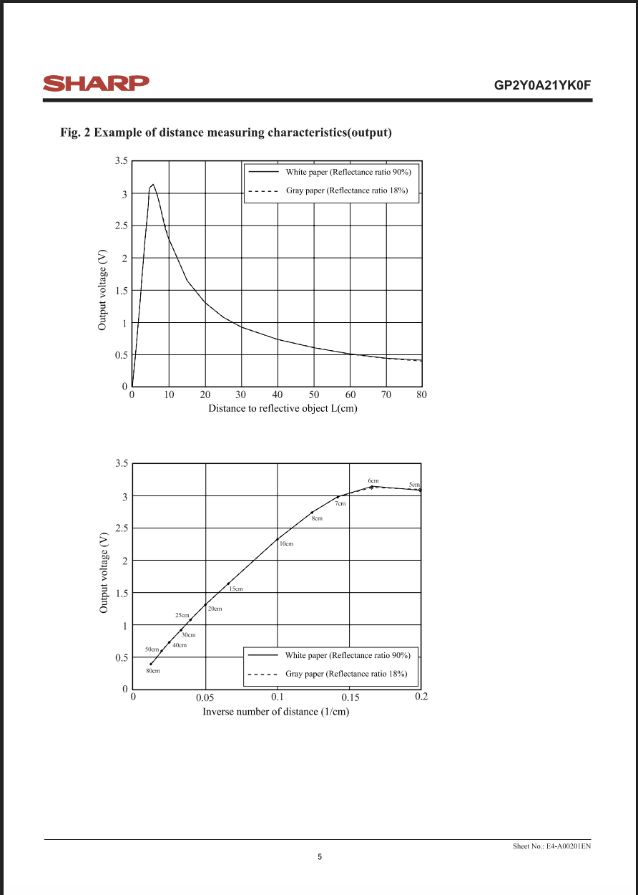

# Innovator Journal 01

## 3D scanner project

### Question: 

How can we create a 3D scanner?

-----------------------------------------------------------------------------------
### Materials:

group 1:
- breadboard
- Arduino
- wires
- sensor
- computer (Macbook Air)
- Adapter

group 2:
- stepper mortor
- Arduino sheild
- wires

-------------------------------------------------------------------------------------
### Process: Class 1-3

**1. Assembling**

Setting up the group 1 materials listed above;

----------------------------------------------------------------------------------------

**2. Coding**

We used the sample code on the [Arduino Website](https://docs.arduino.cc/language-reference/en/functions/analog-io/analogRead/) to get the voltage output on the computer;

As it is shown in the chart below, this sensor outputs different voltage depending on the distance;

 

*please refer [this pdf](https://global.sharp/products/device/lineup/data/pdf/datasheet/gp2y0a21yk_e.pdf) provided by Sharp for details.

-----------------------------------------------------------------------------------------------

My partner and I created the following power law regression equation using a chart and generated the code with Webb GPT to output the actual distance;

*Because the chart exhibits two possible distance values for the same voltage below 10 cm, distances under 10 cm are excluded from the analysis.

 

-----------------------------------------------------------------------------------------

**3. Assembling the group 2 materials** 

We connected the stepper motors with the Arduino board using the Arduino sheild;

 
 

---------------------------------------------------------------------------------------------------------

### Progress & problems

Thanks to my partner, Kaylee Zhu, and Mr. Raus, our group has been making constant progress on this project. We have assembled the Arduino with the scanner and the motor, and we have generated the code to convert the voltage measurement ooutput as real-world distance. Our next step will be assembling hardwares with the stepper motor to make it rotate so it can scan.

Our main struggle was writing the code that allows us to convert the voltage output from the sensor to distance measurements. Since both myself and my partner do not have experience in coding, we ended up relying on WebbGPT to generate the code itself. We haven't comfirmed that the code works, so our next goal is to check the code and adjust if need.

I have had personal skill and emotinal struggles during the process, which I will write about in the emotinal journey section below.

-------------------------------------------------------------------------------------------------------------

### What I learned from this project

Since this is my first time doing projects like this, I have learned a lot from this project:
- How to assemble the materials
- How Arduino works
- How to get an equation for the system, and how to utilize them
- The importance of the basic machinery knowledges in order to contribute in projects like this

----------------------------------------------------------------------------------------------------------
### Emotional journey

Questions:

- How did you feel?
- How did these feelings change as you encountered challenges and made progress?
- How do these feelings relate to your journey of discovery?

I have personally struggling a lot with this project, since this is my first time working with hardwares and softwares. To be honest, this is the most lost I have ever felt in any class, I'm feeling very confused most of the time in class and stuggling to catch up with the other talented and knowledgeable classmates. I think the reason behind this is because of lack of basic knowledge and experience of robotics, machinery, and coding. 

I did not struggle to follow the first class, since it was mainly just assembling and using codes available online to check if it was working. However, since the second class where we started to talk about mathematics and coding behind it, I have been feeling more and more behind. Even though I managed to finish the tasks of each class with the support of my partner and Mr. Raus, my uneasy feelings have been getting bigger, since I don't understand the logics behind them and it feels like I'm doing whatever other people tell me to do.

Since I'm not taking part in any other tech programs, I don't have any other opportunities to catch up, but I will try my best by asking more questions and reaching out to Mr. Raus and other classmates for help.

Although this project has been very stressful and frustrating for me, I will try to use this opportunity as a chance to grow as an innovator and gain knowledge/skillsets that I can utilize in the future.

------------------------------------------------------------------------------------------------------------
### Sources:

Website of my partner, Kaylee Zhu:

[https://jialin-kaylee.github.io/3D_Printer_Journal](https://jialin-kaylee.github.io/3D_Printer_Journal)

Details of the distance measuring sensor, provided by Sharp:

[https://global.sharp/products/device/lineup/data/pdf/datasheet/gp2y0a21yk_e.pdf](https://global.sharp/products/device/lineup/data/pdf/datasheet/gp2y0a21yk_e.pdf)

Details of the Arduino board:

[https://docs.arduino.cc/language-reference/en/functions/analog-io/analogRead/](https://docs.arduino.cc/language-reference/en/functions/analog-io/analogRead/)
