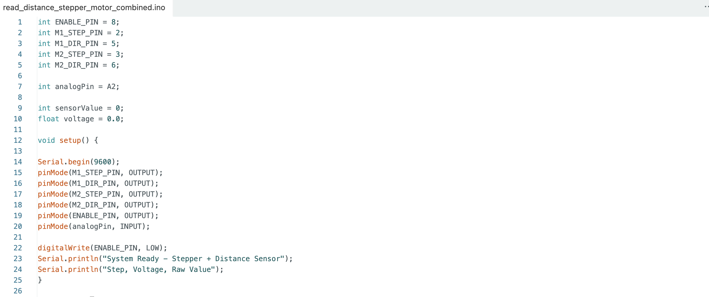
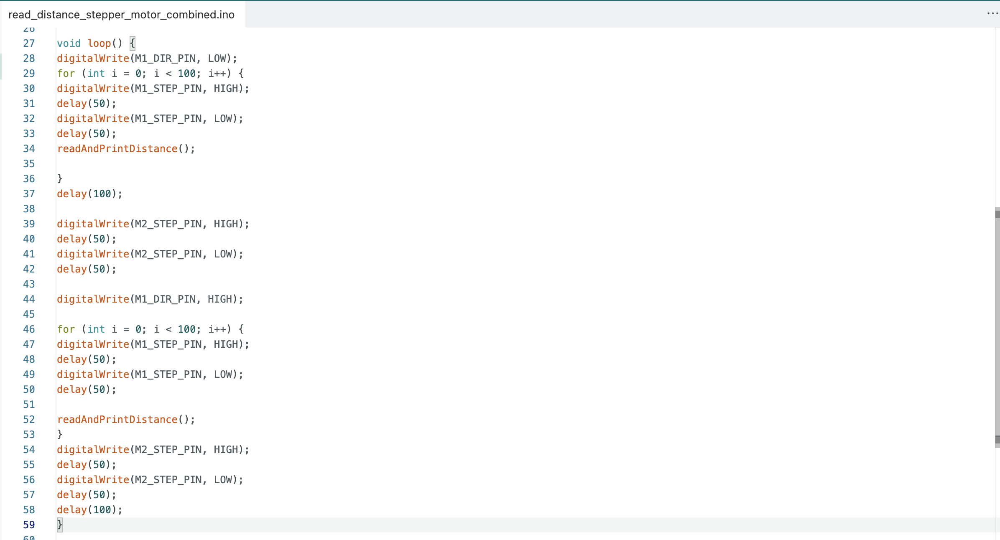
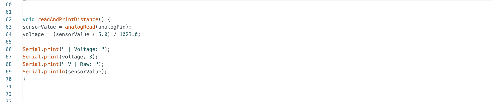

# Innovator Journal 02

## 3D scanner project

### Question: 

How can we create a 3D scanner?

-----------------------------------------------------------------------------------
### Materials:

- breadboard
- Arduino
- wires
- sensor
- computer (Macbook Air)
- adapter
- stepper mortor
- Arduino sheild
- wires

-------------------------------------------------------------------------------------

Please check [Innovator Journal 01](projects/innovatorJournal) for my journey and my process before class 3.

------------------
### Process: After Class 4 -  Class 5

1. Writing the code to spin the stepper motor.
- Setting each pin

Using for loops to repeat the process:
- Set the direction pin to one direction
- Set the step pin high, delay, then low to move one step
- Set the direction pin to the other direction and move one step

-----------------
2. Combining the two codes
- Putting together the stepper motor code and the sensor code (refer to Innovator Journal 01 – Process)
- Modifying the motor code so that one stepper motor rotates 180 degrees horizontally for each vertical step of the other motor
- Adjusting details—such as the delay—so that the sensor has enough time to scan accurately

-----------------------------

### Progress & Problem

Working with my partner Kailey, two other classmates, Mr. Raus, and Webb GPT, I helped write the code for the sensors with duplex communication, as well as the code for the paired stepper motors that move the sensor. Since this was a continuation of previous classes, we were able to apply the knowledge we had already gained and work more efficiently. I spent about an hour during lab time writing the stepper motor code with Mr. Raus, and once that was complete, we used class time to integrate the sensor code described in the last journal entry, combining everything into one unified program.

Our next step will be writing code to extract coordinates from the scan and finding a way to plot those coordinates to create a visual representation of the scanned image. This will be a challenge, but I believe it is achievable if I make good use of the resources and people around me.

------------------
### What I learned from this process

- basic coding (eg. for loop)
  
How to do bigger group work in tech space
- When we were in groups of four creating the combined code in class, I struggled to work alongside the other pair because we also had to share the physical gears, which limited how many people could participate at once. I learned that we can work more effectively by using separate sets of gears and communicating clearly throughout the process.

------------------
### Emotional journey

Because it has been a while since we started this project, I’ve become more familiar with the most important concepts, the gears, and the skills involved. This project was my first time working with hardware and coding, and at first I felt very overwhelmed —it seemed almost impossible. However, now I’m confident that I can handle basic coding and simple hardware assembly, and I don’t feel as lost as I did in the earlier classes. I’ve also learned who to ask for support and when to reach out when I’m struggling.

I’m still growing as an innovator, so I continue to face small challenges in every part of the process. But I don’t feel as anxious when I encounter them, and I think that’s a good sign of my growth.

------------------
### Sources

[https://lastminuteengineers.com/a4988-stepper-motor-driver-arduino-tutorial/](https://lastminuteengineers.com/a4988-stepper-motor-driver-arduino-tutorial/)
