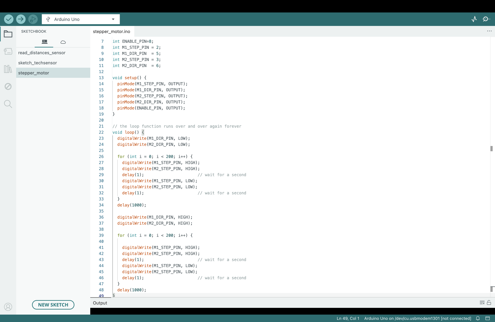

# Innovator Journal 02

## 3D scanner project

### Question: 

How can we create a 3D scanner?

-----------------------------------------------------------------------------------
### Materials:

- breadboard
- Arduino
- wires
- sensor
- computer (Macbook Air)
- adapter
- stepper mortor
- Arduino sheild
- wires

-------------------------------------------------------------------------------------

Please check [Innovator Journal 01](projects/innovatorJournal) for my journey and my process before class 3.

------------------
### Process: After Class 4 -  Class 5

1. Writing the code to spin the stepper motor.
- setting each pins

 Use for loops to repeat the process:
- Set direction pin to one direction
- Set Step pin high, delay, than low to move one step
- Set direction pin to another direction and move on step

-----------------
2. Combining the two codes
- putting together the stepper motor code and the sensor code (reference Innovator Journal 01 Process)
- modifying the motor code so that one stepper motor spins 180 degrees horizontally per one vertical step of the other motor.
- Changing the details (for example the delay, so that the sensor has more time to accurately scan)

-----------------
### Progress & Problem

Along with my partner, Kailey, two other classmates, Mr. Raus, and Webb GPT, I have done the coding for the sensors with duplex communication, with stepper motors to function together as a pair to form a scanner. 

Our next process will be coding to find the coordinates from the scan and find a way to plot the cooardinates to create a visual scanned image.

------------------
### What I learned from this process

- basic coding (ex. for loop)

------------------
### Emotional journey

------------------
### Sources

[https://lastminuteengineers.com/a4988-stepper-motor-driver-arduino-tutorial/](https://lastminuteengineers.com/a4988-stepper-motor-driver-arduino-tutorial/)
